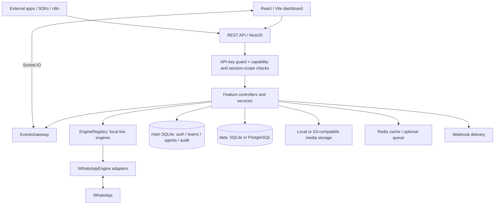
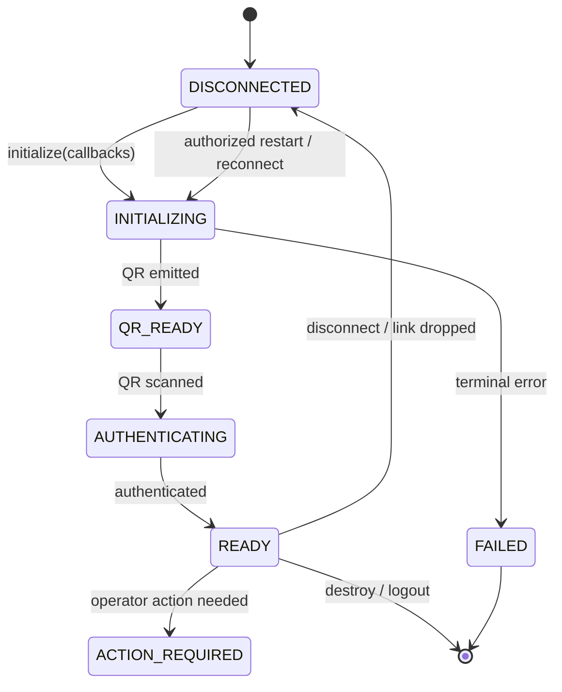
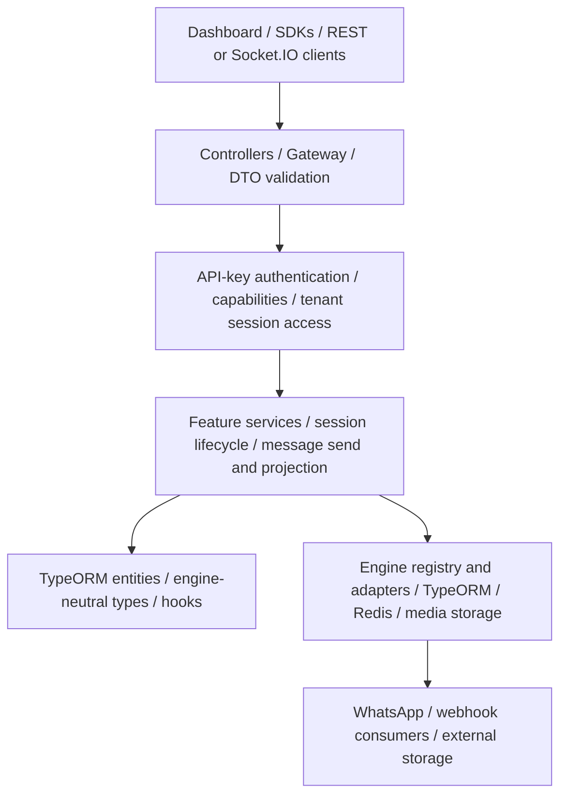
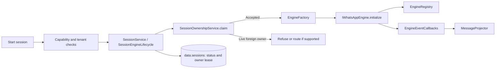
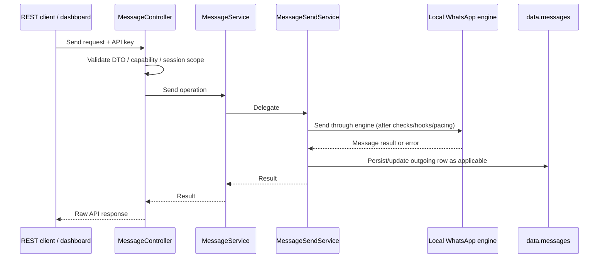
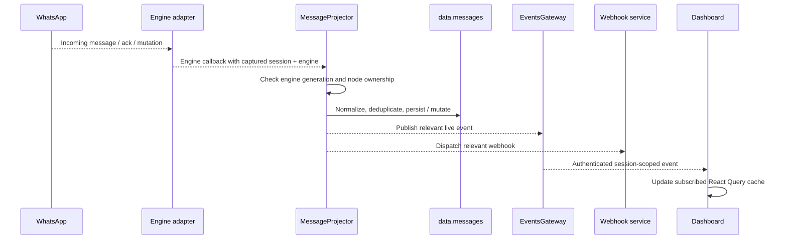
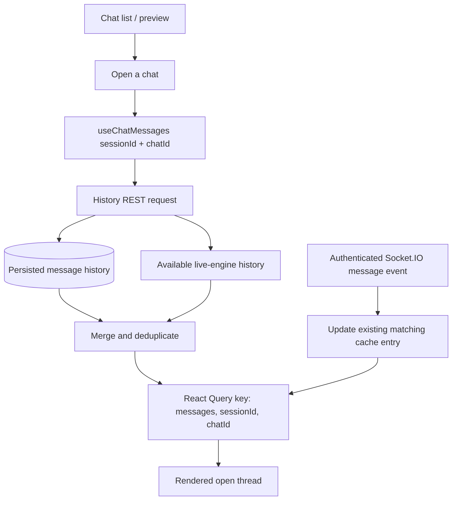
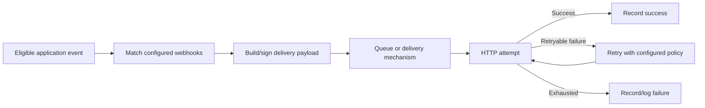
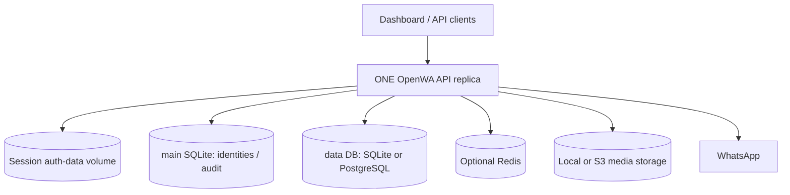
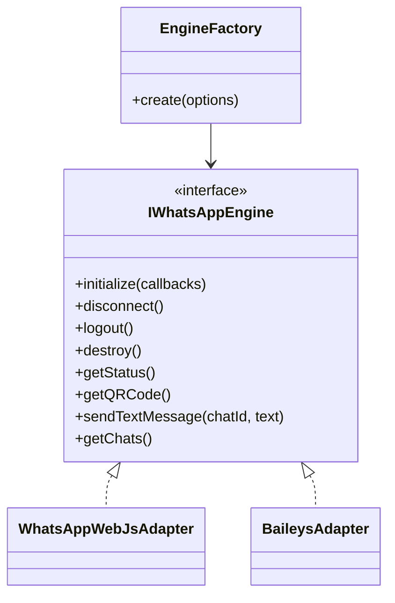

# 03 - System Architecture

> **Scope:** OpenWA `SunProject` branch. This document describes the implemented application and distinguishes implemented multi-node building blocks from the supported deployment topology. The supported deployment remains **one API replica per session-data volume**. See [13 - Horizontal Scaling](./13-horizontal-scaling.md) before changing that topology.

## 3.1 Architecture Overview

OpenWA is a TypeScript/NestJS application with a React/Vite dashboard. It exposes REST, Swagger/OpenAPI, and Socket.IO interfaces to manage WhatsApp sessions, messages, contacts, integrations, and administrative workflows. A running WhatsApp engine is a stateful resource attached to one backend process.



**Core boundaries:** HTTP controllers validate and authorize transport requests; capability services implement operations; `SessionService` and `SessionEngineLifecycle` manage engine lifecycle; `EngineRegistry` exposes the process-local engine; engine adapters translate between WhatsApp libraries and engine-neutral application types. The `MessageProjector` handles engine message events, persistence, and downstream notifications.

An engine event and an HTTP request may produce related messages, but they are not the same execution path. A dashboard chat preview, a persisted history row, and an open thread's React Query cache may become current at different times; each stage must be traced independently when diagnosing sync problems.

## 3.2 Pluggable Architecture Philosophy

### Implemented boundaries

| Boundary | Implemented mechanism | Configuration / limitation |
| --- | --- | --- |
| WhatsApp engine | `IWhatsAppEngine`, plugin loader and `EngineFactory`; `whatsapp-web.js` or Baileys | `ENGINE_TYPE`; changing engines requires restart and compatibility checks for saved auth state. |
| User-data database | Named TypeORM `data` connection | `DATABASE_TYPE=sqlite` or `postgres`. |
| Identity/audit database | Named TypeORM `main` connection | Always SQLite, even when `data` uses PostgreSQL. |
| Media storage | `StorageService` branches between local filesystem and S3-compatible storage | `STORAGE_TYPE=local` or `s3`; regular message media is not automatically archived through this service. |
| Cache and event fan-out | `CacheService` uses Redis when enabled; Socket.IO Redis adapter can relay broadcasts | `REDIS_ENABLED=true`; without Redis, cache operations fail open and fan-out remains local. |
| Background jobs | Queue modules and processors handle applicable asynchronous work | A normal outbound message is **not** required to pass through BullMQ. |

The WhatsApp engine is the formal interchangeable interface. Storage and cache are concrete services with configuration-dependent behavior; the named TypeORM connections are configured in `src/app.module.ts`. There is no generic `IStorageAdapter`, `ICacheAdapter`, or dynamic `AdaptersModule` shared by all these boundaries.

### Engine-neutral identity contract

The engine boundary normalizes WhatsApp identities where implemented. The preferred user form is `<phone>@c.us`; group IDs use `<id>@g.us`; an unresolved privacy identifier remains `<lid>@lid`. `@s.whatsapp.net` and hosted number dialects normalize to the user form, but an LID must **never** be treated as a phone number merely because it contains digits. Other special forms include status, broadcast, and newsletter identifiers.

The shared helpers are in `src/engine/identity/wa-id.ts`; the interface is in `src/engine/interfaces/whatsapp-engine.interface.ts`. Normalization is not proof that every contact, chat listing, and outbound engine method has completed a full engine-neutral migration. Verify each adapter method before extending it.

### Engine lifecycle and process ownership



`EngineStatus` is an enum; engines are initialized using an `EngineEventCallbacks` object instead of a generic event emitter. Status changes, incoming messages, outgoing echoes, acks, edits, revocations, reactions, QR updates, and history callbacks are routed through that callback contract.

`EngineRegistry` contains the actual engine objects **in memory**. `SessionOwnershipService` stores a session's node identity and a renewable lease in the `data` database. Database ownership prevents a second node from legitimately claiming the same live session; it does not serialize or move an engine object between processes. A failed lease-renewal query is not itself proof of lost ownership. Once renewal establishes that a claim was lost, the local engine must be retired.

### NestJS module and dependency-injection wiring

`src/app.module.ts` imports concrete feature modules and creates two named TypeORM connections. Services obtain repositories through `@InjectRepository(Entity, 'main' | 'data')` and engines through injected capability services or `EngineRegistry`; controllers must not import `IWhatsAppEngine` or resolve engines directly. These are standard NestJS providers, analogous to FastAPI dependency injection for service and database dependencies, except NestJS resolves providers through module registration.

## 3.3 Layered Architecture



This is a **descriptive layering model**, not a claim that the codebase has separate repository interfaces for every entity. Most services inject TypeORM `Repository<T>` directly. Controllers delegate business logic to services and preserve NestJS's normal raw-response behavior.

## 3.4 Module Structure

The directories below show responsibility and relevant paths rather than a complete file inventory.

```text
src/
├── main.ts                         # NestJS bootstrap
├── app.module.ts                   # Feature modules; named main/data connections
├── common/
│   ├── cache/                      # Optional Redis CacheService
│   ├── storage/                    # Local/S3 StorageService
│   ├── security/ errors/ utils/ services/
├── config/                         # Configuration, validation, feature flags
├── core/                           # Plugins, hooks, agent tools
├── database/
│   ├── data-source.ts              # data connection
│   ├── data-source-main.ts         # main connection
│   ├── migrations/                 # data schema migrations
│   └── migrations-main/            # main schema migrations
├── engine/
│   ├── engine.module.ts
│   ├── engine.factory.ts
│   ├── engine-registry.service.ts   # Process-local engine map
│   ├── interfaces/whatsapp-engine.interface.ts
│   ├── identity/                    # JID and LID mapping helpers
│   ├── adapters/                    # whatsapp-web.js, Baileys
│   └── builtin/                     # Built-in engine plugins
└── modules/
    ├── auth/                       # Keys, roles, guards, capabilities
    ├── access-control/             # SessionTenantAccessService, session scopes
    ├── teamleader/                 # Admin/team-leader/agent APIs and quota
    ├── session/                    # SessionService, lifecycle, ownership, projector
    ├── takeover/                   # Expired-owner session recovery
    ├── message/                    # MessageService, MessageSendService, entities
    ├── events/                     # Socket.IO gateway and subscriptions
    ├── webhook/ queue/             # Webhook processing / background work
    ├── chat-media/ status-store/    # Optional archives and status persistence
    └── ...                         # Other capability and integration modules

dashboard/src/
├── App.tsx                          # Application and role-aware routes
├── services/api.ts                  # REST client and raw API payloads
├── hooks/                           # React Query hooks, including chat messages
├── i18n/                            # Locale configuration and catalogs
└── ...                              # Pages and UI components
```

### Ownership of core behaviors

| Component | Responsibility |
| --- | --- |
| `SessionService` / `SessionEngineLifecycle` | Create, start, stop, reconnect, retire, restore, and delete sessions through the existing lifecycle. |
| `SessionOwnershipService` | Claim/renew/release database-backed session ownership; detect lost claims. |
| `SessionTakeoverService` | Periodically consider eligible sessions whose previous owner's lease expired; use the normal start path. |
| `EngineRegistry` | Retrieve or require an engine **on the current node**. |
| `MessageSendService` | Validate, pace, hook, send, and record outbound messages. |
| `MessageProjector` (`src/modules/session/message-projector.service.ts`) | Persist inbound and own-send events, history, and message mutations; emit events/webhooks as appropriate. |
| `SessionTenantAccessService` | Resolve effective session scope and check live/historical access consistently across transports. |
| `EventsGateway` | Authenticated Socket.IO subscriptions and application event delivery. |

## 3.5 Core Components Design

### 3.5.1 Session manager, registry, and owner lease



A process should not operate on a foreign node's engine by reading the local registry and assuming a missing engine means a disconnected session. Lifecycle operations must respect ownership and use the existing session service instead of directly deleting rows or auth files.

### 3.5.2 Outbound message flow



Ordinary outbound messages use the engine directly. A queue or worker is **not** an unconditional stage in this path. Linked-device outgoing echoes and delivery acknowledgements can also arrive asynchronously through the `MessageProjector` and reconcile the stored row.

### 3.5.3 Inbound projection and history



Bulk historical sync persists history without treating every historical message as a new live arrival. Database rows, the WebSocket event stream, and the dashboard cache are separate observability points. Message mutation application is keyed by session and WhatsApp message ID to avoid competing edits/reactions, while stored messages use a session-scoped WhatsApp-message-ID uniqueness constraint.

### 3.5.4 Webhooks and queues

Webhook registration and delivery are distinct from sending a WhatsApp message. A relevant event can enqueue a delivery job, retry failed HTTP delivery, and record delivery failure. Redis/BullMQ is used when configured and appropriate; do not redraw the normal WhatsApp send path as necessarily going through a queue.

## 3.6 Data Flow Diagrams

### 3.6.1 Dashboard chat loading and live updates



The hook keys messages per session and chat and merges persisted and available engine history. Its long-lived cache and event-driven updates mean a changing **chat preview does not prove that the open thread cache changed**. When investigating missing messages, check persistence, session/chat ID normalization, socket subscription, event shape, cache key, and whether a refetch occurs after connection/reconnection. Do not treat opening the chats page as an acceptable requirement for receiving messages.

### 3.6.2 Webhook delivery



### 3.6.3 Message identity and phone attribution

`data.messages` stores WhatsApp IDs (`from`, `to`, `chatId`, and optional group `author`) separately from resolved `sentByPhone` and `sentToPhone` fields. The latter are nullable digit-only phone numbers **when WhatsApp exposes or the configured resolver can establish a number**. For inbound groups, use the real participant (`author`) for sender attribution rather than the group's JID. For an unresolved `@lid`, preserve the identifier and leave the phone column null; never manufacture a number. An outgoing message's recipient phone also may be unknown when it targets a group or another non-phone identity.

The message's `sessionId` is intentionally a scalar identifier with **no TypeORM relation / database foreign key to the live `Session` row**: historical message provenance must survive physical session deletion. The `data` database also has historical session authorization data (`session_tombstones`), allowing applicable history reads after deletion while preventing access to another tenant's history. This is a deliberate exception to adding foreign keys indiscriminately.

## 3.7 Technology and Deployment Architecture

| Layer | Technology / implementation |
| --- | --- |
| API | Node.js, NestJS, TypeScript, TypeORM |
| Dashboard | React, TypeScript, Vite, React Query, Socket.IO client |
| WhatsApp connectivity | `whatsapp-web.js` with Puppeteer/Chromium, or Baileys without a browser |
| Persistent authentication/teams/audit | `main` SQLite database |
| Session and message data | `data`: SQLite (`better-sqlite3`) or PostgreSQL |
| Cache and optional distributed event fan-out | Redis when enabled; cache is not the source of truth |
| Media storage | Local filesystem or S3-compatible storage; optional chat-media archive |



**Supported topology:** deploy one API replica per session-data volume. PostgreSQL, Redis, and S3 increase backend/storage options but **do not automatically make multi-replica operation supported**. The `main` database, local auth directories, live engine registry, and remaining process-local security/operation state must all be considered before a future distributed deployment.

## 3.8 API Architecture

REST controllers expose session-scoped and administrative operations; controller routing is defined by source decorators and the global prefix configured at bootstrap. Common areas include sessions, messages, webhooks, contacts/groups, health, and the Admin/Team Leader/Agent management APIs under `src/modules/teamleader/`. Use the actual decorators and generated OpenAPI schema when documenting exact paths rather than treating a conceptual diagram as an authoritative route list.

**Response contract:** successful handlers return their ordinary payload directly (object or array); the application does not globally wrap it in `{ success, data, meta }`. Input validation uses DTOs and standard NestJS validation behavior. API-key authorization and per-session tenant checks must apply on the server even when the dashboard hides an unauthorized route.

For session-scoped HTTP requests, the optional owner-forwarding path uses configured node URLs to route a request arriving at a non-owner to the live owner. This is not a guarantee that all transports and lifecycle operations are distributed-ready. Without `NODE_URL`, the forwarding path is inert.

## 3.9 Security Architecture

### Authentication, capabilities, and tenant scope

The API key roles are `ADMIN`, `OPERATOR`, `VIEWER`, `TEAM_LEADER`, and `AGENT`. Role/capability authorization and access to a **particular session** are separate decisions:

| Principal | Effective session scope before additional `allowedSessions` restriction |
| --- | --- |
| Admin, Operator, Viewer | Legacy role's session scope; capabilities still control operations. |
| Team Leader | Sessions with matching `ownerTeamLeaderId`. |
| Agent | Assigned session only, and only within the associated Team Leader's ownership. No assignment means no session access. |

A nonempty `allowedSessions` list is an **intersection / ceiling**, never a grant that bypasses role or owner restrictions. `SessionTenantAccessService` resolves this scope for live sessions and has a separate historical-access method for deleted-session history. A foreign or inaccessible session intentionally returns `404` rather than revealing its existence; insufficient general permission is a separate `403` concern. REST, WebSocket, and MCP entry points should reuse the same service instead of implementing divergent tenant checks.

The team-leader and agent identities and their API key bindings live in `main`; live `Session.ownerTeamLeaderId` and `Agent.assignedSessionId` span the `main`/`data` database boundary. They are not ordinary cross-database foreign keys: ownership and assignments must be validated in application services. Within `main`, the API-key-to-Team-Leader/Agent relations are regular TypeORM relations.

### Agent template quota

`AgentTemplateQuotaService` maintains the rolling 24-hour quota for authenticated Agent **stored-template sends**. This is distinct from general sending pace, per-route HTTP rate limits, or a quota on plain text/media messages. Do not describe it as a universal WhatsApp messaging limit.

### Other safeguards

Maintain API-key authentication, route capability checks, validated DTOs, trusted-proxy/IP policy, SSRF protections on remote media and webhook destinations, constrained storage keys, bounded media processing, and audit logging where implemented. Never log full message bodies, phone numbers, API keys, or full database query parameters in production diagnostic logs.

## 3.10 Error Handling Architecture

NestJS built-in HTTP exceptions produce the framework's ordinary error response (for example `{ statusCode, message, error }`); there is no global success-envelope or custom all-errors wrapper. Domain errors from `src/common/errors/` extend built-in exceptions where applicable.

| Situation | Typical status | Interpretation |
| --- | --- | --- |
| Missing/invalid API credential | `401` | Authentication failed. |
| Authenticated key lacks a required capability | `403` | Operation not permitted. |
| Session does not exist **or is outside effective tenant scope** | `404` | Do not disclose foreign session existence. |
| Invalid DTO/request argument | `400` | Validation failed. |
| Engine not ready / ownership conflict | `409` where mapped | Retry or reconcile before a stateful operation. |
| Engine capability not implemented | `501` where mapped | The selected adapter cannot provide that operation. |
| Engine transport unavailable | `503` where mapped | Transport/service unavailable. |
| Agent stored-template quota reached | `429` | Quota/retry policy applies. |

The exact status for an endpoint follows its existing exception mapping. Do not replace the underlying exception with a generic `200` response containing an error object.

## 3.11 Scalability Considerations

> **Partially implemented, not a supported multi-replica topology.** Keep API replicas at one per session-data volume. See [13 - Horizontal Scaling](./13-horizontal-scaling.md), including its known gaps, before considering more than one.

### Implemented ownership and takeover

`SessionOwnershipService` conditionally claims a session using `nodeId`, `nodeUrl`, `claimedAt`, and `leaseExpiresAt` on the `Session` row. Its default lease TTL is 60 seconds, with a 20-second heartbeat. An owner renews eligible live claims and releases them when stopping; another node may claim an unowned or expired claim. A node that confirms it lost ownership retires its local engine. Database clocks across nodes must be synchronized for time-based claims to be meaningful.

`SessionTakeoverService` periodically scans for eligible sessions previously held by a different node with an expired lease. Its sweep defaults to 30 seconds and is gated by session auto-start configuration. It starts eligible authenticated sessions through the ordinary lifecycle rather than directly instantiating engines. Deliberately stopped, pairing, or operator-failed sessions must not be indiscriminately restarted. Stuck in-flight bulk batches from a dead owner are failed, **not automatically resumed**, because their sent-message outcome may be unknown.

### Implemented optional distribution mechanisms

- **Session-scoped HTTP forwarding:** with a reachable `NODE_URL` configured for every node, an eligible request can be forwarded once to the live owner after authentication; a loop/conflict is rejected. The default proxy timeout is 60 seconds. This is opt-in and does not route every protocol or execution path.
- **Socket.IO fan-out:** with Redis enabled, broadcasts can reach clients connected to another node. Mid-connection key revocation state and per-key WebSocket throttling remain process-local.
- **Startup coordination:** PostgreSQL deployments include coordination for startup migrations, but that alone does not make the full application distributed-safe.

### Remaining barriers

Some lifecycle watchdog/reconnect paths and bulk-send live state remain process-local; MCP/agent-tool execution is not universally forwarded; WebSocket key eviction and rate-limit state are not globally synchronized. Local auth state and the fixed `main` SQLite database also require deliberate sharing/consistency decisions. Therefore do not present a load balancer with `replicas: 3`, node affinity, or automatic high availability as a currently supported deployment. Those are design targets.

## 3.12 Engine Abstraction Layer



`EngineFactory.create()` accepts an options object including a session **name** (`sessionId`, for the on-disk authentication key) and a separate session **UUID** (`dbSessionId`, for database-bound stores). The factory resolves the configured engine via the plugin loader; the legacy direct fallback constructs only `whatsapp-web.js` and must not silently substitute it for a missing Baileys plugin. Engine initialization registers `EngineEventCallbacks` and starts the underlying connection.

**Adapter distinction:** `whatsapp-web.js` runs WhatsApp Web through Chromium/Puppeteer; Baileys uses a browser-free protocol connection. Both must fulfill the engine interface, but method support and inbound/outbound ID conversions must be checked per adapter. A configured engine switch is a restart/migration operation, not hot-swapping a live engine.

## 3.13 Pluggable Infrastructure Backends

### 3.13.1 Storage service

`src/common/storage/storage.service.ts` implements local and S3-compatible operations (`putFile`, `getFile`, `deleteFile`, listing, backup import/export). `STORAGE_TYPE=s3` can target AWS S3 without a custom endpoint or an S3-compatible provider such as MinIO using `S3_ENDPOINT`. Treat `S3_ENDPOINT` and path-style access as endpoint-specific configuration; MinIO is not a separate storage type. Storage-key validation prevents unsafe paths. Optional chat-media archival is a separate, feature-gated behavior; don't imply every incoming attachment is always archived.

### 3.13.2 Database connections and migration policy

| Connection | Backend | Primary entities | Migration location |
| --- | --- | --- | --- |
| `main` | SQLite | API keys, Team Leaders, Agents, Agent template usage, audit | `src/database/migrations-main/` |
| `data` | `better-sqlite3` or PostgreSQL | Sessions, messages, webhooks, templates, integrations, ownership, history/tombstone records | `src/database/migrations/` |

Use the exact repository connection name for every entity. A relation crossing `main` and `data` is **not a database FK**, even if the stored identifiers refer to related business objects. Some data-model exceptions are intentional, notably `Message.sessionId` retaining deleted-session history. For production, use migrations (`DATABASE_SYNCHRONIZE=false`); test both supported data-database dialects for schema changes and avoid assuming that SQL valid on PostgreSQL also runs on `better-sqlite3`.

SQLite has a single-writer concurrency model. PostgreSQL supports more concurrent writes but does not solve WhatsApp engine process ownership or `main` SQLite sharing by itself.

### 3.13.3 Cache, Redis, and queues

`CacheService` uses Redis directly when enabled; when disabled or unreachable, reads return no cache value and writes are no-ops rather than providing a hidden in-memory cache. Redis can also support queue processing and cross-replica Socket.IO event **broadcasts** where configured, but it is not a universal replacement for process-local engine/authorization state.

### 3.13.4 Deployment profiles and limits

| Profile | Data DB | Media | Redis | API replicas |
| --- | --- | --- | --- | --- |
| Local development | SQLite | Local | Optional / off | One |
| Larger single-node deployment | PostgreSQL | Local or S3 | Optional / on | One |

Capacity depends on workload, engine, media behavior, and resources; do not interpret a storage or memory profile as a supported session count or a declaration of multi-replica safety. `MAX_CONCURRENT_SESSIONS` may be configured to bound running/initializing sessions. Changes to database/storage/engine backend selection normally require restart and appropriate state or schema migration.

---

[← 02 - Requirements Specification](./02-requirements-specification.md) · [Documentation Index](./README.md) · [Next: 04 - Security Design →](./04-security-design.md)
