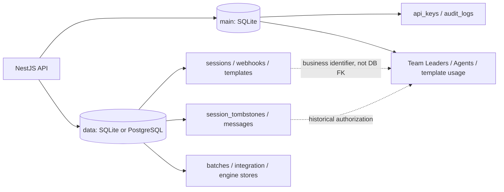
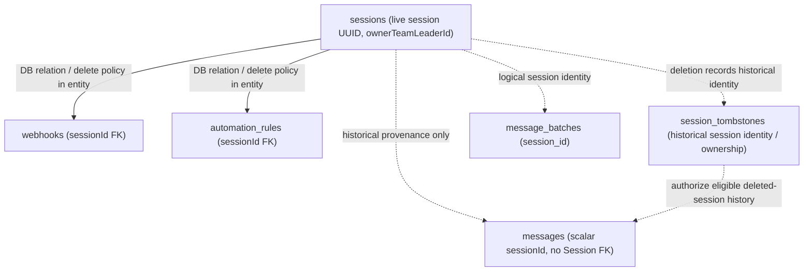
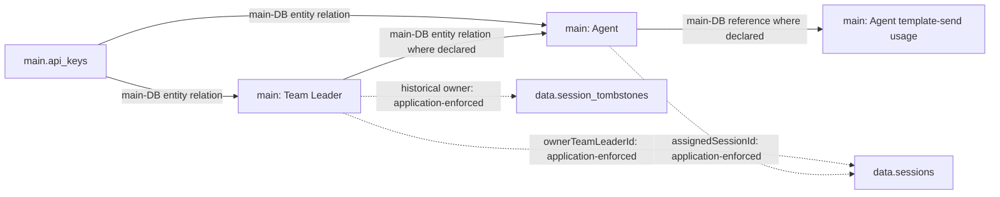
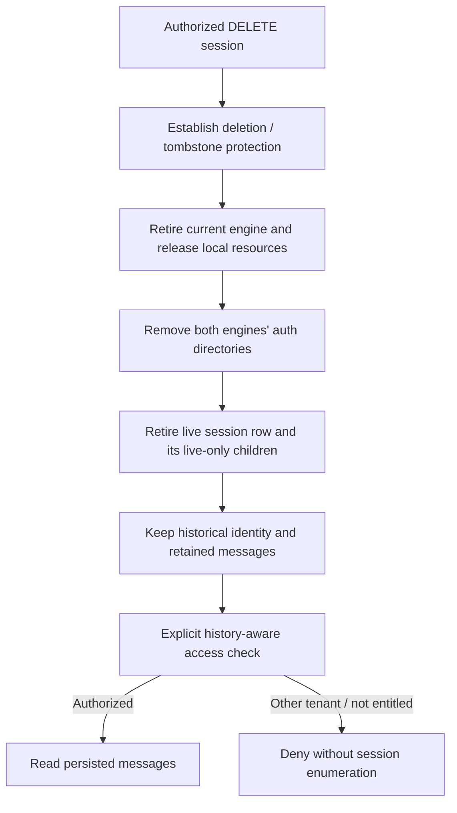
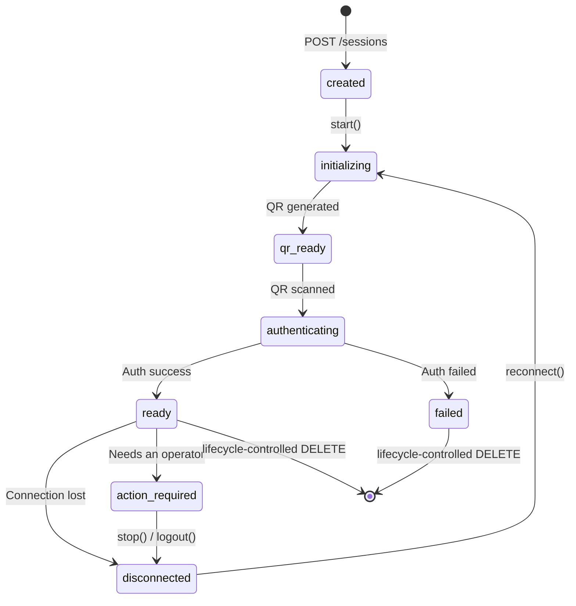
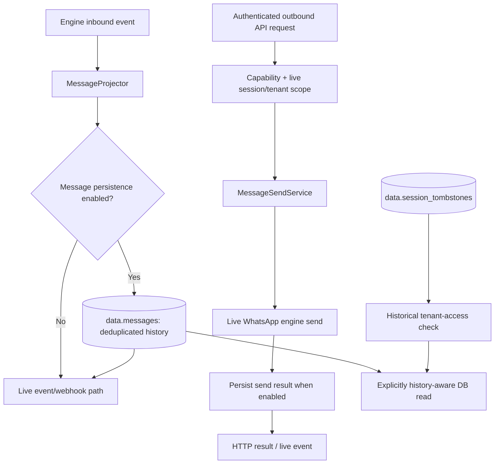
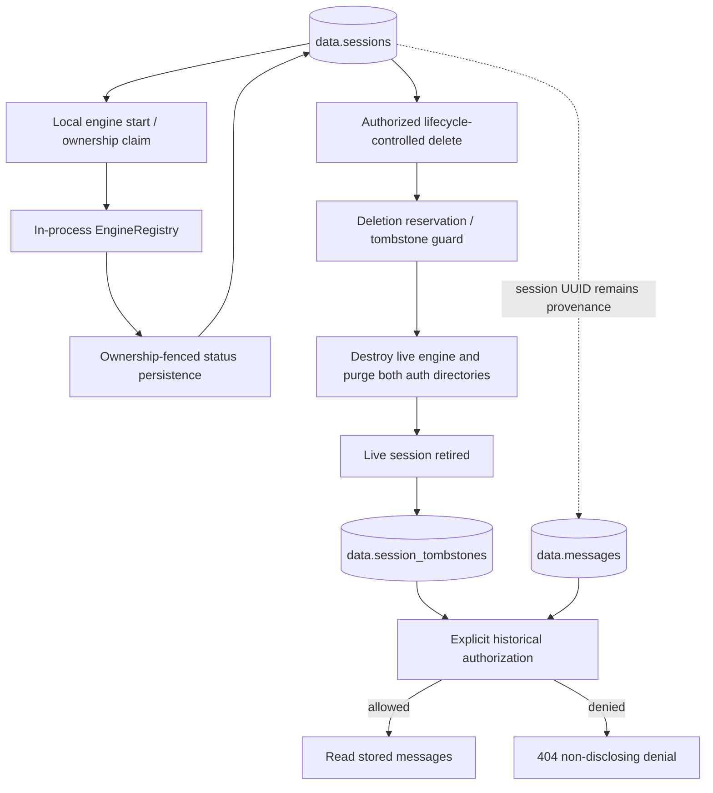
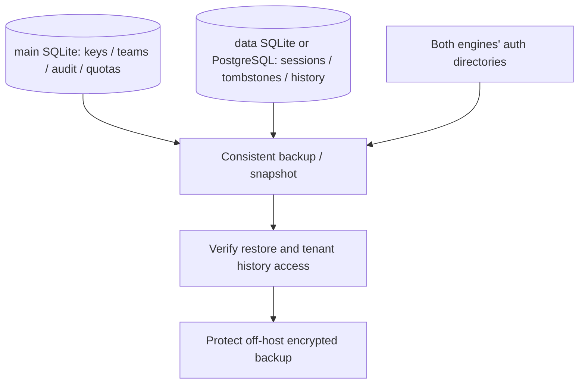

# 05 - Database Design

> **Branch scope:** `SunProject`. This chapter distinguishes the *live session* from
> its *historical tombstone*, describes the two named TypeORM connections, and identifies
> cross-connection business identifiers that **cannot** be enforced by a database FK.
> SQL blocks below are architectural illustrations unless marked as exact existing SQL:
> entity decorators and applied migration files in the checked-out commit are the
> authoritative column definitions and constraints. Do not apply illustrative DDL
> directly to a production database.

## 5.1 Overview

OpenWA uses a database to store:

- Session configuration & state
- Webhook configurations
- Message history (optional)
- API keys & authentication
- Audit logs
- Team Leaders, Agents, Agent assignments and Agent template-send usage
- Deleted-session tombstones for historical authorization
- Session ownership / lease metadata and tenant-aware message history

### Database Support

The `main` connection is **always SQLite**. The independently configured `data`
connection uses SQLite (`better-sqlite3`) or PostgreSQL. The choice of PostgreSQL
improves concurrent-write capacity; it does **not** make multi-API-replica production
deployment supported. Live engines and some workflow state remain process-local.

| Database / connection | Primary responsibility | Deployment qualification |
| --- | --- | --- |
| Main SQLite | Authentication, teams, Agent quotas and audit | Separate connection even when `data` also uses SQLite |
| Data SQLite | Sessions, tombstones, messages, webhooks and integration data | Single-writer concurrency; do not infer a fixed maximum session count |
| Data PostgreSQL | The same data model with stronger concurrent-write capacity | Ownership leases/forwarding do not by themselves make multi-replica deployment safe |

Back up **both** databases and the engine-auth directories. Database rows do not
contain the WhatsApp authentication credentials. See §5.8 for a full-system backup.


### Dual-Database Architecture



| Connection | Default / configuration | Principal stored records |
| --- | --- | --- |
| `main` | SQLite, default `./data/main.sqlite`; path overridable via `MAIN_DATABASE_NAME` | `api_keys`, `audit_logs`, Team Leader and Agent records, Agent template-send usage |
| `data` | `DATABASE_TYPE=sqlite` or `postgres` | `sessions`, `session_tombstones`, `webhooks`, `messages`, `message_batches`, `templates`, engine stores, integration and automation records |

**Cross-connection identifiers are not foreign keys.** `Session.ownerTeamLeaderId`
(on `data`) and `Agent.assignedSessionId` (on `main`) link business entities in
separate databases. Application services validate ownership and assignment; a
PostgreSQL foreign key cannot point into the application's separate SQLite database.
Within `main`, API-key-to-Team-Leader/Agent relations can use the ordinary TypeORM
relations defined by their actual entities.

**Historical provenance is intentionally separate from a live session.**
`messages.sessionId` is a scalar identifier with **no FK to `sessions.id`** so
retained message history can outlive a deleted live session. A corresponding
`session_tombstones` record preserves the information needed to make an explicit
historical access decision. The tombstone is not a running engine or a route to
start/send again. See §§5.2, 5.3.1 and 5.5.

The main connection stays SQLite to allow local authentication and audit data to
remain separate from a replaceable data database. Switching the `data` connection
does **not** migrate `main` records or their cross-database identifiers.


#### Built-in PostgreSQL Orchestration

When using PostgreSQL Built-in mode (`POSTGRES_BUILTIN=true`), `DockerService.onModuleInit()` runs a bootstrap orchestration that starts the managed `postgres` container (alongside `redis` / `minio` when their own `REDIS_BUILTIN` / `MINIO_BUILTIN` flags are set). This happens **during** Nest module initialization, not before it — there is no pre-bootstrap step in `main.ts`.

Because the container can therefore still be coming up when the `data` connection first dials it, that connection is configured with `retryAttempts: 10` and `retryDelay: 3000` (`src/app.module.ts`), giving the database roughly 30 seconds to become reachable.

> [!NOTE]
> If the Docker API is unreachable, orchestration logs a warning and is skipped — no container is started, and the `data` connection then fails its retries against whatever `DATABASE_HOST` points at.

#### PostgreSQL Schema Selection

When using PostgreSQL, OpenWA can place its tables and migration ledger in a dedicated schema via the `POSTGRES_SCHEMA` environment variable:

| Setting           | Default  | Description                                                      |
| ----------------- | -------- | ---------------------------------------------------------------- |
| `POSTGRES_SCHEMA` | `public` | PostgreSQL schema for OpenWA tables and TypeORM migration ledger |

**Use Cases:**

- **Managed PostgreSQL:** Use your cloud provider's project schema (e.g., a schema provisioned by the provider)
- **Multi-tenant databases:** Isolate OpenWA from other applications sharing the same database
- **Clean separation:** Keep OpenWA's tables organized separately from other schemas

**Configuration:**

```bash
# .env or dashboard Infrastructure page
POSTGRES_SCHEMA=openwa  # Use a dedicated schema
POSTGRES_SCHEMA=public   # Default behavior (historical)
```

**Requirements:**

- The schema must already exist before migration time
- Built-in PostgreSQL container automatically creates the schema via init script
- External/managed PostgreSQL: run `CREATE SCHEMA <name>;` once before first startup
- SQLite ignores this setting

**Validation:**

- Schema name is validated at boot as a legal Postgres identifier (letters, digits, underscores, max 63 chars)
- Reserved `pg_` prefix is rejected to prevent conflicts with system schemas
- Invalid values cause fast boot failure rather than migration-time errors

> [!NOTE]
> TypeORM's `schema` option alone does not set the session `search_path`. OpenWA additionally sets `search_path=<schema>,public` via PostgreSQL's startup `options` parameter so raw, unqualified migration DDL resolves to the configured schema. The migration ledger and all tables land in the specified schema while keeping `public` accessible for `pg_catalog` and helpers.

#### Data Migration API

OpenWA provides endpoints for migrating data between database types:

| Endpoint                 | Method | Description                          |
| ------------------------ | ------ | ------------------------------------ |
| `/api/infra/export-data` | GET    | Export all Data DB tables as JSON    |
| `/api/infra/import-data` | POST   | Import JSON data (replaces existing) |

**Migration Workflow:**

```bash
# 1. Export from current database
curl -s 'http://localhost:2785/api/infra/export-data' \
  -H 'X-API-Key: YOUR_KEY' > backup.json

# 2. Change database configuration (SQLite → PostgreSQL or vice versa)

# 3. Restart application with new config

# 4. Import to new database
curl -X POST 'http://localhost:2785/api/infra/import-data' \
  -H 'X-API-Key: YOUR_KEY' \
  -H 'Content-Type: application/json' \
  -d @backup.json
```

#### Cross-Database Date Portability

To ensure date/time values work across both SQLite and PostgreSQL, OpenWA uses a `DateTransformer` that stores dates as ISO 8601 text strings:

```typescript
// src/common/transformers/date.transformer.ts
export const DateTransformer: ValueTransformer = {
  from: (value: string | null) => value ? new Date(value) : null,
  to: (value: Date | null) => value ? value.toISOString() : null,
};

// Usage in entities (Data DB only)
@Column({ type: 'text', nullable: true, transformer: DateTransformer })
connectedAt: Date | null;
```

> [!NOTE]
> Main DB entities (api_keys, audit_logs) use native SQLite `datetime` type since they always remain in SQLite.

## 5.2 Entity Relationship Diagram

The two diagrams below separate **database-enforced relations** (solid lines)
from **logical ownership / historical associations** (dotted lines). A scalar
identifier is *not* a TypeORM relation just because it has the same value as a
primary key elsewhere.

### Data connection — live and historical records



The `session_tombstones` shape and which other session-scoped tables carry an FK must
be taken from `src/modules/session/` entities and the migrations in the checked-out
branch. Do **not** infer that every table with a `sessionId` column cascades on
session deletion. In particular, `messages.sessionId` intentionally does not.

### Main connection and cross-connection boundaries



An Agent's session access is the intersection of authenticated role/capability,
Team Leader ownership, current assignment, and any `allowedSessions` ceiling.
Historical access is a **separate** permission check; it must not resurrect a
deleted session or grant access to another tenant's messages.


## 5.3 Table Specifications

> [!IMPORTANT]
> **Column names are camelCase — with one exception.** There is no snake_case naming strategy on
> either connection, so the columns really are `"sessionId"`, `"createdAt"`, `"waMessageId"` and so
> on, and hand-written SQL must quote them: unquoted, PostgreSQL folds them to lowercase and the
> statement fails at runtime.
>
> The exception is **`message_batches`**, whose columns genuinely are `batch_id` / `session_id` /
> `created_at` — it was created that way and never renamed. So no single rule covers the whole
> schema; the DDL below states each table's real names, and `SELECT * FROM <table> LIMIT 0` settles
> any doubt. The **types** in these blocks stay illustrative (they are dialect-portable and defined
> by the TypeORM entities), but every identifier is literal.

### 5.3.1 sessions and session_tombstones

`sessions` stores **live** WhatsApp session configuration, process ownership and
connection state. Deletion is not an extra engine state such as `status='deleted'`:
a historical record is kept separately and the live session is retired through the
lifecycle controls. Do not query tombstones when looking for engines to auto-start,
adopt or reconnect.

The following SQL is a *schematic* representation of the live table. Check the
current entity and migrations for any branch-specific additions and exact types.

```sql
CREATE TABLE sessions (
    id UUID PRIMARY KEY DEFAULT gen_random_uuid(),
    name VARCHAR(100) NOT NULL UNIQUE,
    status VARCHAR(50) NOT NULL DEFAULT 'created',
    phone VARCHAR(20),
    "pushName" VARCHAR(100),
    config JSONB NOT NULL DEFAULT '{}',
    "proxyUrl" VARCHAR(255),
    "proxyType" VARCHAR(10),
    "connectedAt" TIMESTAMP WITH TIME ZONE,
    "lastActiveAt" TIMESTAMP WITH TIME ZONE,
    -- Session ownership / multi-node routing: which process runs the engine, since when, where it
    -- answers HTTP for peers, and how long its claim survives unrenewed. All NULL on a single node.
    "nodeId" VARCHAR(190),
    "claimedAt" TIMESTAMP WITH TIME ZONE,
    "nodeUrl" VARCHAR(2048),
    "leaseExpiresAt" TIMESTAMP WITH TIME ZONE,
    "ownerTeamLeaderId" VARCHAR,           -- logical reference to main DB, NOT a DB FK
    "createdAt" TIMESTAMP WITH TIME ZONE NOT NULL DEFAULT NOW(),
    "updatedAt" TIMESTAMP WITH TIME ZONE NOT NULL DEFAULT NOW()
);
```

> [!NOTE]
> The **types** above are illustrative — the schema is defined by the TypeORM entity (`src/modules/session/entities/session.entity.ts`) and column types are dialect-portable (`jsonColumnType()` → `simple-json`, dates via `DateTransformer`). The **column names are literal**: see the naming note in §5.3 below before writing SQL against any of these tables. The `sessions` entity declares only the index implied by the `UNIQUE` constraint on `name`; there are no separate `status`/`phone`/`createdAt` indexes.

> [!NOTE]
> Auth state is **not** stored in this table. Both engines persist credentials on the **filesystem** (`whatsapp-web.js` LocalAuth; Baileys `useMultiFileAuthState`). The `baileys_stored_messages` table holds only Baileys' serialized message store (the library ships none), not credentials.

#### Session tombstones and deletion invariants

`session_tombstones` is the **historical session-identity / tenant-authorization
record** used when a live session row has been removed but retained records such
as `messages` still refer to its UUID. It must preserve the identifying and
ownership context required by `SessionTenantAccessService.assertHistoricalSessionAccess`
for authorized history reads. Its exact columns, uniqueness policy and physical
retention are migration-specific; do **not** assume a `deletedAt` column on
`sessions`, a fixed expiry interval, or a particular `session_tombstones` DDL
without inspecting the branch's entity and migration.



**Race safety:** an in-flight `start()` can finish after deletion has begun. The
session lifecycle must recheck the deletion marker after initialization, tear
down any newly initialized engine, and re-purge auth files. Never implement
user-facing deletion as `repository.delete(id)` alone: that bypasses engine
teardown, reservation/ownership fencing and filesystem cleanup. See
[`31-session-lifecycle-design.md`](./31-session-lifecycle-design.md) INV-5.

**Lease/takeover safety:** an expired ownership lease can permit an eligible live
session to be adopted; a deleted session is **not eligible**. A stale engine
callback or losing node must not recreate a live row, clobber the tombstone, or
restore a deleted session to `ready`. A lease-loss cleanup destroys local engines
without writing a competing status row. See the lifecycle invariant catalog,
INV-3/INV-5/INV-6/INV-7.

**Authorization safety:** only explicitly history-aware endpoints may call
`assertHistoricalSessionAccess`. Live-session methods must use
`assertSessionAccess` and must not treat a tombstone as a usable session.

**Session Status Values:**



| Status            | Description                                                       |
| ----------------- | ----------------------------------------------------------------- |
| `created`         | Session created, not started                                      |
| `initializing`    | Starting browser & WhatsApp                                       |
| `qr_ready`        | QR code ready for scanning                                        |
| `authenticating`  | QR scanned, authenticating                                        |
| `ready`           | Connected and ready                                               |
| `disconnected`    | Disconnected, can reconnect                                       |
| `action_required` | Engine running, but it needs an operator before it can work again |
| `failed`          | Failed, needs recreation                                          |

`action_required` differs from `failed` in that the engine is still loaded and still holds its
WhatsApp connection — nothing is broken, but something outside the gateway has to change before the
session is usable. The reason is carried on `lastError`, and every engine-backed action (`stop`,
`logout`) still applies; sending is refused until the session returns to `ready`. Reaching it always
takes deliberate evidence, never a single failed probe, precisely because it stops sends. A restart
clears it, and so does a gateway restart.

**Config Schema:**

`config` is an opaque JSON blob; the keys the session service actually reads are:

```json
{
  "maxReconnectAttempts": 5,
  "reconnectBaseDelay": 5000,
  "autoRejectCalls": false
}
```

| Key                    | Default   | Effect                                                                   |
| ---------------------- | --------- | ------------------------------------------------------------------------ |
| `maxReconnectAttempts` | unlimited | Reconnect attempt cap, clamped to 0–20 (`0` disables reconnect entirely) |
| `reconnectBaseDelay`   | `5000` ms | Base delay of the reconnect backoff, clamped to 1000–300000 ms           |
| `autoRejectCalls`      | `false`   | Auto-reject an incoming call as soon as it rings                         |

Set them at creation with `POST /api/sessions`, or on an existing session with
`PATCH /api/sessions/{sessionId}/config` — no restart, and no re-scan of the QR. The patch merges, so a key
it does not mention keeps its stored value, and an explicit `null` clears a key back to the default
above (the only way back to unlimited reconnect attempts once a cap is set).

When each takes effect differs, because each is read at a different moment: `autoRejectCalls` is
re-read from this row on every incoming call, so a patch applies to the next call. The two reconnect
keys are read once per `start()` into the in-memory reconnect state, so a patch applies on the next
start and leaves a reconnect sequence already in flight alone.

`GET /api/sessions/{sessionId}/config` reports the effective values. It reports only these three keys and
never the raw column — `config` is stripped from `SessionResponseDto` alongside the
credential-bearing `proxyUrl`, and echoing an opaque blob back would defeat that.

> [!NOTE]
> Proxy settings are **not** read from `config` — they live in the dedicated `proxyUrl` / `proxyType` columns shown in the DDL above. Puppeteer options are global engine configuration from the environment (`engine.puppeteer.*`), not per-session. Anything else placed in `config` is stored but ignored.

---

### 5.3.2 webhooks

Stores webhook endpoint configurations.

```sql
CREATE TABLE webhooks (
    id UUID PRIMARY KEY DEFAULT gen_random_uuid(),
    "sessionId" UUID NOT NULL REFERENCES sessions(id) ON DELETE CASCADE,
    url VARCHAR(2048) NOT NULL,
    events JSONB NOT NULL DEFAULT '["message.received"]',
    secret VARCHAR(255),
    headers JSONB DEFAULT '{}',
    filters JSONB,                       -- optional smart pre-filter; null = fire on every subscribed event
    active BOOLEAN NOT NULL DEFAULT true,
    "retryCount" INTEGER NOT NULL DEFAULT 3,
    "lastTriggeredAt" TIMESTAMP WITH TIME ZONE,
    "createdAt" TIMESTAMP WITH TIME ZONE NOT NULL DEFAULT NOW(),
    "updatedAt" TIMESTAMP WITH TIME ZONE NOT NULL DEFAULT NOW()
);
```

**Events Schema (allowed values):**

```json
[
  "message.received",
  "message.sent",
  "message.ack",
  "message.failed",
  "message.revoked",
  "message.reaction",
  "message.edited",
  "status.received",
  "session.status",
  "session.qr",
  "session.authenticated",
  "session.disconnected",
  "session.reconnect_loop",
  "session.restriction",
  "presence.update",
  "group.join",
  "group.leave",
  "group.update",
  "group.join_request",
  "call.received",
  "call.accepted",
  "call.rejected",
  "call.missed"
]
```

---

### 5.3.2a automation_rules

Per-session single-message autoreply rules. `conditions` reuses the webhook filter shape verbatim
(null/empty matches every inbound message); the reply goes through the ordinary send path.

```sql
CREATE TABLE automation_rules (
    id UUID PRIMARY KEY DEFAULT gen_random_uuid(),
    "sessionId" VARCHAR NOT NULL REFERENCES sessions(id) ON DELETE CASCADE,
    name VARCHAR(100) NOT NULL,
    enabled BOOLEAN NOT NULL DEFAULT true,
    conditions JSONB,                    -- webhook filter shape; null = match every inbound message
    "replyText" TEXT NOT NULL,
    "cooldownSeconds" INTEGER NOT NULL DEFAULT 60,  -- per-(rule, chat) quiet period; 0 disables
    "createdAt" TIMESTAMP WITH TIME ZONE NOT NULL DEFAULT NOW(),
    "updatedAt" TIMESTAMP WITH TIME ZONE NOT NULL DEFAULT NOW()
);
```

---

### 5.3.3 messages

Stores message history (optional, can be disabled). This is a **plain (non-partitioned)** table — the same schema on SQLite and PostgreSQL. `sessionId` deliberately has **no FK to the live `sessions` table**: deleting a session must not automatically erase historical provenance. Access to persisted records for a deleted UUID uses a historical session tombstone and an explicit historical authorization check, not a live engine lookup.

`sentByPhone` / `sentToPhone` are nullable resolved phone numbers, **not WhatsApp JIDs**. Keep `from`, `to`, `chatId` and optional group `author` as the authoritative identity fields. An unresolved `@lid` cannot be converted into a phone by treating its numeric identifier as a telephone number. For an inbound group message, resolve the actual sender from `author` rather than the group JID; group/non-phone recipients may have no recipient phone.

```sql
CREATE TABLE messages (
    id UUID PRIMARY KEY DEFAULT gen_random_uuid(),
    "sessionId" UUID NOT NULL,           -- intentionally NO REFERENCES sessions(id)
    "waMessageId" VARCHAR,                -- nullable; transient outgoing rows have none yet
    "chatId" VARCHAR NOT NULL,
    "chatName" VARCHAR,                   -- nullable; contact pushName / group name when known
    author VARCHAR,                       -- nullable; participant JID for group message ("from" may be group)
    "sentByPhone" VARCHAR,                -- nullable: resolved sender phone, not a fabricated LID
    "sentToPhone" VARCHAR,                -- nullable: resolved recipient phone; group/non-phone IDs may have no number
    "from" VARCHAR NOT NULL,
    "to" VARCHAR NOT NULL,
    body TEXT,
    type VARCHAR NOT NULL DEFAULT 'text',
    direction VARCHAR NOT NULL DEFAULT 'outgoing',  -- 'incoming' | 'outgoing'
    timestamp BIGINT,                     -- WhatsApp epoch seconds; read back as a JS number
    metadata JSONB,
    status VARCHAR NOT NULL DEFAULT 'sent',          -- pending | sent | delivered | read | failed
    "createdAt" TIMESTAMP WITH TIME ZONE NOT NULL DEFAULT NOW(),
    "mediaPath" VARCHAR,                  -- nullable; storage key of the archived media copy
    "mediaMimetype" VARCHAR               -- nullable; mimetype of that archived copy
);

-- Indexes (declared on the entity). Names TypeORM derives are hashes, not readable slugs —
-- the literal names are below so `DROP INDEX` / EXPLAIN output can be matched against them.
-- There is deliberately NO standalone "sessionId" index: the composite below leads with
-- "sessionId", so it already serves session-only lookups (see DropRedundantMessagesSessionIdIndex).
CREATE INDEX "IDX_399833392126349ef0b04b9bed" ON messages("sessionId", "createdAt");
CREATE INDEX "IDX_36bc604c820bb9adc4c75cd411" ON messages("chatId");
CREATE INDEX "IDX_befd307485dbf0559d17e4a4d2" ON messages(status);
CREATE INDEX "IDX_messages_createdAt" ON messages("createdAt");   -- createdAt-only stats aggregates

-- Inbound dedup (issue #464): one row per ("sessionId", "waMessageId").
-- NULL "waMessageId" rows are exempt (SQL treats NULLs as distinct).
CREATE UNIQUE INDEX "UQ_messages_sessionId_waMessageId"
    ON messages("sessionId", "waMessageId");
```

> [!NOTE]
> There is **no** PostgreSQL RANGE partitioning, `create_messages_partition()` function, or `pg_cron` schedule in OpenWA. `messages` is a single plain table on both backends. The `timestamp` column uses a `bigint→number` value transformer so the REST/SDK/MCP contract returns a JS number on both SQLite and PostgreSQL.

> [!NOTE]
> Message rows carry no separate `media`/`ack`/`from_me`/`is_group` columns. Media and other engine-specific details are stored in the `metadata` JSON column; delivery state is the `status` enum and `direction` distinguishes inbound vs. outbound.

---

### 5.3.4 (removed) contacts

> [!NOTE]
> **There is no `contacts` table.** Contacts are read live from the engine on demand (e.g. `GET /sessions/:id/contacts`) and are not persisted to the database.

---

### 5.3.5 api_keys, Team Leaders and Agents (main connection)

These records are held in the **always-SQLite `main` connection**. Their actual
entity decorators and `migrations-main/` files define the live DDL. The short
SQL below retains the original `api_keys` example and documents its changed
business relationships; it is not a complete migration for all three entities.

```sql
-- Illustrative shape: check ApiKey entity and the applied main migrations.
CREATE TABLE api_keys (
    id VARCHAR PRIMARY KEY,
    name VARCHAR(100) NOT NULL,
    "keyHash" VARCHAR(64) NOT NULL UNIQUE,
    "keyPrefix" VARCHAR(12) NOT NULL,
    role VARCHAR(20) NOT NULL DEFAULT 'operator',
    "allowedIps" TEXT,
    "allowedSessions" TEXT,
    "isActive" BOOLEAN NOT NULL DEFAULT 1,
    "expiresAt" DATETIME,
    "lastUsedAt" DATETIME,
    "usageCount" INTEGER NOT NULL DEFAULT 0,
    "createdAt" DATETIME NOT NULL DEFAULT (datetime('now')),
    "updatedAt" DATETIME NOT NULL DEFAULT (datetime('now'))
    -- Main-DB Team Leader / Agent links: exact column names and FK actions
    -- must be read from the current ApiKey entity and main migrations.
);
```

`ApiKeyRole` contains **`ADMIN`, `OPERATOR`, `VIEWER`, `TEAM_LEADER` and `AGENT`**.
A role/capability check and a session-level ownership/assignment check are
separate. A nonempty `allowedSessions` list further **restricts** the effective
session scope; it does not grant an Agent access to an unassigned session or a
Team Leader access to another Team Leader's session.

**Team Leader / Agent relationship:** the Team Leader and Agent entities, their
API-key bindings and Agent stored-template usage records live in `main`. Agent
assignment (`assignedSessionId`) points logically to a `data.sessions` UUID;
`data.sessions.ownerTeamLeaderId` points logically back to an owner in `main`.
Neither is a cross-database SQL FK. Changes to ownership, assignment or team
records require service-layer consistency checks and relevant permissions.

**Template quota records:** `AgentTemplateQuotaService` uses the `main` connection
to account for an authenticated Agent's rolling 24-hour **stored-template send**
quota. These records are not a generic WhatsApp send-rate limit and do not replace
session authorization. Check the actual `AgentTemplateSendUsage` entity for its
column names, indexes and deletion policy; do not guess an unverified DDL.

**Deletion and retained history:** reassignment or deletion of a live session
must not silently transfer its tombstone-backed historical messages to another
Agent or Team Leader. Historical access is checked against the stored historical
identity and the authenticated caller's permitted scope.


### 5.3.6 audit_logs

Consolidated audit trail for API-key, session, message, and webhook events. This is the **only** audit table — there are no separate `session_logs`, `webhook_logs`, or `api_key_logs` tables. Lives on the **main** (always-SQLite) connection.

```sql
CREATE TABLE audit_logs (
    id VARCHAR PRIMARY KEY,
    action VARCHAR(50) NOT NULL,                   -- e.g. session_created, message_sent, webhook_failed
    severity VARCHAR(10) NOT NULL DEFAULT 'info',  -- info | warn | error
    "apiKeyId" VARCHAR(36),
    "apiKeyName" VARCHAR(100),
    "sessionId" VARCHAR(36),
    "sessionName" VARCHAR(100),
    "ipAddress" VARCHAR(45),
    "userAgent" VARCHAR(500),
    method VARCHAR(10),
    path VARCHAR(500),
    "statusCode" INTEGER,
    metadata TEXT,                                 -- simple-json
    "errorMessage" TEXT,
    "createdAt" DATETIME NOT NULL DEFAULT (datetime('now'))
);

-- Indexes (declared on the entity; TypeORM-derived hash names)
CREATE INDEX "IDX_cee5459245f652b75eb2759b4c" ON audit_logs(action);
CREATE INDEX "IDX_741fa976d1e04e695f3aa23cb8" ON audit_logs("apiKeyId");
CREATE INDEX "IDX_dd2b6e43c767b6b5b2bb227ace" ON audit_logs("sessionId");
CREATE INDEX "IDX_c69efb19bf127c97e6740ad530" ON audit_logs("createdAt");
```

**Audit actions** are an enum (`AuditAction`) spanning API-key lifecycle (`api_key_created`,
`api_key_updated`, `api_key_used`, `api_key_revoked`, `api_key_deleted`, `api_key_auth_failed`), session
lifecycle (`session_created`, `session_started`, `session_stopped`, `session_force_killed`,
`session_logged_out`, `session_deleted`, `session_qr_generated`, `session_connected`,
`session_disconnected`, `session_config_updated`), WhatsApp-imposed account restrictions (`session_restricted`,
`session_restriction_lifted`), messages
(`message_sent`, `message_failed`), send-pacing enforcement (`send_pacing_blocked`, sampled to at
most one row per session per minute; `send_breaker_tripped`, never sampled), webhooks (`webhook_created`, `webhook_deleted`,
`webhook_triggered`, `webhook_failed`), rate-limit enforcement (`rate_limit_exceeded`, sampled to at
most one row per subject+kind per minute), the queue dashboard (`queue_board_mutated`), integration
plugin instances (`integration_instance_created`, `integration_instance_updated`,
`integration_instance_secret_regenerated`, `integration_instance_deleted`,
`integration_instance_redriven`), and ADMIN-only infrastructure operations (`infra_config_saved`,
`infra_restart_requested`, `infra_data_exported`, `infra_data_imported`, `infra_storage_exported`,
`infra_storage_imported`).

> [!NOTE]
> Audit-log retention is automatic: see [§5.7 Data Retention](#57-data-retention). Other event types (session logs, API access logs) are surfaced via structured application logging, not dedicated database tables. The one exception is a webhook delivery that exhausts every retry — that lands in the `webhook_delivery_failures` table (§5.3.8), not just the log stream.

### 5.3.7 message_batches

Tracks bulk/batch message jobs. A single table holds the job state plus its messages, options, progress, and per-message results as JSON columns (there are **no** separate `batch_jobs` / `batch_job_messages` tables).

```sql
CREATE TABLE message_batches (
    id UUID PRIMARY KEY DEFAULT gen_random_uuid(),
    batch_id VARCHAR NOT NULL,
    session_id VARCHAR NOT NULL,
    status VARCHAR NOT NULL DEFAULT 'pending',   -- pending | processing | completed | cancelled | failed
    messages JSONB NOT NULL,                     -- [{ chatId, type, content, variables? }]
    options JSONB,                               -- { delayBetweenMessages, randomizeDelay, stopOnError }
    progress JSONB,                              -- { total, sent, failed, pending, cancelled }
    results JSONB,                               -- [{ chatId, status, messageId?, error?, sentAt? }]
    current_index INTEGER NOT NULL DEFAULT 0,
    created_at TIMESTAMP WITH TIME ZONE NOT NULL DEFAULT NOW(),
    updated_at TIMESTAMP WITH TIME ZONE NOT NULL DEFAULT NOW(),
    started_at TIMESTAMP WITH TIME ZONE,
    completed_at TIMESTAMP WITH TIME ZONE,
    CONSTRAINT "UQ_message_batches_session_id_batch_id" UNIQUE (session_id, batch_id)
);
```

> [!NOTE]
> Batch-id uniqueness is **scoped to the session**, not global — one session cannot deny a batch id to another, so the same `batch_id` may exist under different sessions.

**Batch Status Values:**

| Status       | Description                    |
| ------------ | ------------------------------ |
| `pending`    | Job created, not yet processed |
| `processing` | Sending messages in progress   |
| `completed`  | All messages processed         |
| `cancelled`  | Job cancelled by user          |
| `failed`     | Job failed (fatal error)       |

---

### 5.3.8 Other data-connection tables

The data connection also owns:

- **`templates`** — reusable message templates (`src/modules/template/entities/template.entity.ts`), with a unique constraint on `(sessionId, name)` — one template name per session.
- **`status_updates`** — inbound status/story broadcasts with a 24-hour TTL (`src/modules/status-store/entities/status-update.entity.ts`); unique on `(sessionId, waStatusId)`. Attached media is stored via `StorageService`, not in the row.
- **`webhook_delivery_failures`** — durable record of a webhook delivery that exhausted all retries (`src/modules/webhook/entities/webhook-delivery-failure.entity.ts`), surfaced via the ADMIN `GET /webhooks/delivery-failures`.
- **`plugin_instances`** — one configured instance of an adapter plugin, keyed `${pluginId}:${instanceId}` (`src/modules/integration/entities/plugin-instance.entity.ts`); holds the host-minted ingress HMAC secret, masked on API reads.
- **`ingress_events`** — persist-before-ack durable row and inbound dedup oracle, unique on `(pluginId, instanceId, providerDeliveryId)` (`src/modules/integration/entities/ingress-event.entity.ts`). The full payload is retired to `NULL` once dispatch is settled, leaving a slim dedup marker.
- **`conversation_mappings`** — bidirectional WA-chat ↔ provider-conversation mapping plus handover state (`src/modules/integration/entities/conversation-mapping.entity.ts`).
- **`integration_delivery_failures`** — DLQ-of-record for both inbound (ingress) and outbound (provider egress) delivery failures (`src/modules/integration/entities/integration-delivery-failure.entity.ts`).
- **`baileys_stored_messages`** — Baileys engine message store — the serialized WAMessage proto (`src/engine/adapters/baileys-stored-message.entity.ts`); present only when the Baileys engine is used. (Credentials live on the filesystem, not here.)
- **`lid_mappings`** — LID↔phone-number identity mappings (`src/engine/identity/lid-mapping.entity.ts`).
- **`session_tombstones`** — historical session identity / ownership retained after the live session is removed, for explicit tenant-scoped history authorization. This does **not** represent an engine, a reconnect candidate or a normal live-session route target. Verify the exact entity/migration fields before adding SQL or import/export assumptions.

Additionally, the `AddMessagesFts` migration creates the full-text-search structures over `messages` (a FTS5 virtual table on SQLite, a generated `body_ts` `tsvector` column plus GIN index on PostgreSQL) that back the `/search` endpoint.

> [!NOTE]
> **Do not invent tables or physical constraints.** The supplied baseline did not implement `contacts`, `session_logs`, `webhook_logs`, `api_key_logs`, `webhook_idempotency`, or `ip_whitelist`. The SunProject Team Leader/Agent and session-tombstone additions do not by themselves imply that any of those unrelated tables exist. Check the checked-out entities and migrations; `api_keys.allowedIps` is inline rather than a separate IP-whitelist table.

---

## 5.4 Index Strategy

### Query Pattern Analysis

These indexes are the ones shown in the supplied baseline entity-backed design;
additional SunProject indexes on tombstones, ownership and team/Agent records
must be checked in the corresponding entity decorators and applied migrations.
Do not assert that a new index exists solely because a query would benefit from it.

| Query Pattern                    | Index Used                                                  | Frequency |
| -------------------------------- | ----------------------------------------------------------- | --------- |
| Get session by ID                | `sessions.id` (PK)                                          | Very High |
| Get session by name              | `sessions.name` (UNIQUE)                                    | High      |
| List messages by session (paged) | `("sessionId", "createdAt")` composite                      | Very High |
| Look up message by chat          | `"chatId"`                                                  | High      |
| Ack/dedup a message              | `UQ_messages_sessionId_waMessageId` (UNIQUE)                | Very High |
| Message stats over a date range  | `IDX_messages_createdAt`                                    | Medium    |
| Find a session's webhooks        | `IDX_webhooks_sessionId`                                    | Very High |
| Authenticate API key             | UNIQUE on `api_keys("keyHash")`, main DB                    | Very High |
| Historical message access        | `session_tombstones` lookup and tenant check; inspect entity/migration for physical index | Depends on history use |
| Tenant-scoped live sessions      | `sessions.ownerTeamLeaderId` / Agent assignment; inspect entity/migration for physical indexes | Depends on team activity |
| Filter audit logs                | `audit_logs` indexes on `action` / `apiKeyId` / `sessionId` | Medium    |

### Composite & Unique Indexes (as implemented)

```sql
-- messages: paged listing per session + ack-driven status update / inbound dedup
CREATE INDEX        "IDX_399833392126349ef0b04b9bed"      ON messages("sessionId", "createdAt");
CREATE UNIQUE INDEX "UQ_messages_sessionId_waMessageId"   ON messages("sessionId", "waMessageId");
CREATE INDEX        "IDX_messages_createdAt"              ON messages("createdAt");

-- webhooks: the dispatch path filters by session on every emitted event
CREATE INDEX "IDX_webhooks_sessionId" ON webhooks("sessionId");

-- message_batches: batch ids are unique per session, not globally.
-- Note the snake_case: this table really is named that way — see the naming note in §5.3.
CREATE UNIQUE INDEX "UQ_message_batches_session_id_batch_id" ON message_batches(session_id, batch_id);

-- audit_logs (main DB): filter by action / key / session, ordered by time
CREATE INDEX "IDX_cee5459245f652b75eb2759b4c" ON audit_logs(action);
CREATE INDEX "IDX_c69efb19bf127c97e6740ad530" ON audit_logs("createdAt");
```

> [!NOTE]
> The partial/filtered indexes shown in earlier drafts (e.g. `WHERE status = 'ready'`, `WHERE active = true`) are not part of the current schema. Add them only if a real query pattern justifies the maintenance cost.

### Index Maintenance

```sql
-- Check index usage
SELECT
    schemaname,
    tablename,
    indexname,
    idx_scan,
    idx_tup_read,
    idx_tup_fetch
FROM pg_stat_user_indexes
ORDER BY idx_scan DESC;

-- Find unused indexes
SELECT
    schemaname || '.' || relname AS table,
    indexrelname AS index,
    pg_size_pretty(pg_relation_size(i.indexrelid)) AS index_size,
    idx_scan as index_scans
FROM pg_stat_user_indexes ui
JOIN pg_index i ON ui.indexrelid = i.indexrelid
WHERE NOT indisunique
AND idx_scan < 50
ORDER BY pg_relation_size(i.indexrelid) DESC;

-- Reindex to reclaim space (run during maintenance window)
REINDEX TABLE messages;
```

## 5.5 Data Flow

### Message Storage Flow



An ordinary outbound send is not required to pass through BullMQ. Webhook delivery
and bulk-send orchestration have their own queues/workers or process-local state;
do not merge them into a fictitious mandatory send queue. The persisted-message
endpoint, live WhatsApp history endpoint, socket events and React Query thread
cache are distinct data paths.

### Live Session, Tombstone and Ownership Flow



The filesystem holds engine credentials; an in-memory registry holds active
engine objects; `sessions` holds live connection/ownership metadata;
`session_tombstones` holds the historical authorization context. These are not
interchangeable stores. In particular, a tombstone cannot be used by takeover,
boot restoration or sending to manufacture a running engine.


## 5.6 Migration Strategy

OpenWA uses two named TypeORM connections, separate entity registrations and
separate migration ledgers. `main` is always SQLite; `data` is SQLite or
PostgreSQL. The baseline migration examples in the supplied document predate
some SunProject features and are **not** a complete branch migration inventory.

| Connection | CLI DataSource | Migrations | Responsibility |
| --- | --- | --- | --- |
| `main` | `src/database/data-source-main.ts` | `src/database/migrations-main/` | `api_keys`, `audit_logs`, Team Leader, Agent, Agent template-send usage |
| `data` | `src/database/data-source.ts` | `src/database/migrations/` | Live sessions and ownership, historical tombstones, messages/phone attribution, webhooks, templates, batches, integrations and engine stores |

**Schema change rules:** add columns/constraints to the proper entity and an
additive migration on the **same** connection. Cross-database Team Leader/Agent
↔ session relationships must remain application-validated scalar references;
do not introduce an impossible SQL FK across `main` and `data`. Do not add a
`messages.sessionId → sessions.id` FK; it would conflict with deliberately
retained history after live-session deletion.

### Tombstone migration and data-preservation checklist

When changing session deletion or historical access, inspect the current
`Session` and tombstone entities, `SessionTenantAccessService`,
`session-engine-controls.ts`, `SessionOwnershipService`, and the migration(s)
that introduced `session_tombstones`. The exact migration **filename and
schema are intentionally not guessed here** because the live SunProject source
could not be retrieved in this documentation pass.

1. Ensure the historical record contains the session UUID and the ownership
   information required to enforce deleted-session history access.
2. Define the intended uniqueness, replacement and retention policy for that
   record in the actual entity/migration; document any dialect differences.
3. Ensure deletion leaves retained historical messages addressable by their
   original `sessionId` while removing or deactivating live-session resources.
4. Confirm that another tenant cannot gain access by recreating a session with
   the same display name, changing an Agent assignment or presenting a guessed UUID.
5. Cover concurrent `start`/`delete`, stale engine callbacks, lease-loss cleanup,
   takeover scans and repeated deletes. Tests should verify that a completed
   asynchronous initialization cannot resurrect a deleted session.
6. Test migration and rollback on **both** `better-sqlite3` and PostgreSQL;
   review any SQLite table-rebuild and PostgreSQL index/constraint differences.
7. Extend export/import only according to the current implementation's real
   table manifest. A `session_tombstones` export/import contract must be
   verified rather than silently assumed.

### Running and validating migrations

```bash
# Data DB: SQLite or PostgreSQL
npm run migration:show
npm run migration:run

# Main DB: always SQLite
npm run migration:show:main
npm run migration:run:main

# Confirm entity/migration consistency using the checked-out branch's scripts
npx tsc --noEmit -p tsconfig.json
npm test -- --runInBand
```

The `migration:show:main` command is illustrative: confirm it exists in the
checked-out `package.json` before using it. `DATABASE_SYNCHRONIZE=true` is not
a substitute for reviewed production migrations. Match the current runtime
`AppModule` flags and main/data migration configuration; do not apply the main
migrations to the data connection or vice versa.

### Production migration and backup safety

Back up **both databases and engine-auth directories** before a migration. For
cross-database operations, TypeORM does not provide a single atomic transaction
spanning SQLite `main` and PostgreSQL/SQLite `data`. Handle partial completion
through the existing service's validation/compensation strategy, not by assuming
one repository transaction spans both connections. The Data DB JSON
export/import endpoints are *not* a full-system backup of `main` or auth state.


## 5.7 Data Retention

### Retention Policies

The supplied baseline documents five automated _time-based_ retention jobs:
`audit_logs`, `status_updates`, `webhook_delivery_failures`, `ingress_events` and
`integration_delivery_failures`. Separately, `baileys_stored_messages` is
capped per session rather than by age. Verify the current SunProject retention
jobs before treating this list as exhaustive; **`session_tombstones` retention
must not be invented** or implemented as a generic session purge.

Persisted `messages` deliberately may outlive the corresponding **live**
`sessions` row. A deleted-session history API needs both retained messages and
sufficient historical tenant-authorization context. Expiring tombstones while
retaining messages without an alternate authorization mechanism can make the
history inaccessible; dropping tombstones without checking tenant scope can
expose it. Treat tombstones and history as a joint retention/security decision.

| Data Type                     | Default Retention | Configurable                                                    |
| ----------------------------- | ----------------- | --------------------------------------------------------------- |
| Live sessions / Webhooks      | Until lifecycle-controlled deletion / configured cleanup | Do not conflate session row deletion with historical message erasure |
| Messages / Batches            | See current lifecycle and retention implementation | Live-session delete is **not** a blanket message-history cascade; batches may have different cleanup |
| Session tombstones              | Check current entity and retention job | Historical authorization must remain coherent with retained messages |
| Team Leaders / Agents / quotas | Check current main-DB policies | Deleting a team or assignment must not reassign historical session access |
| Status updates                | 24 hours          | No (fixed, matches WhatsApp's own story expiry)                 |
| Audit logs                    | 90 days           | Yes — `AUDIT_RETENTION_DAYS` (≤ 0 disables)                     |
| Webhook delivery failures     | 90 days           | Yes — `WEBHOOK_FAILURE_RETENTION_DAYS` (≤ 0 disables)           |
| Ingress events (dedup rows)   | 7 days            | Yes — `INGRESS_DEDUP_RETENTION_DAYS` (≤ 0 does **not** disable) |
| Integration delivery failures | 90 days           | Yes — `INGRESS_RETENTION_DAYS` (≤ 0 disables this prune only)   |

### Audit-Log Cleanup Job

`AuditService` prunes old `audit_logs` rows. It is **not** a `@Cron` — it runs once at startup, then on a 24-hour `setInterval` (`src/modules/audit/audit.service.ts`):

```typescript
// src/modules/audit/audit.service.ts (abridged)
onModuleInit(): void {
  const parsed = Number.parseInt(process.env.AUDIT_RETENTION_DAYS ?? '', 10);
  const retentionDays = Number.isInteger(parsed) ? Math.max(0, parsed) : 90;
  if (retentionDays <= 0) return; // AUDIT_RETENTION_DAYS <= 0 disables retention

  const runCleanup = () => this.cleanup(retentionDays).catch(/* best-effort */);
  runCleanup();                                              // prune once at startup
  this.cleanupTimer = setInterval(runCleanup, 24 * 60 * 60 * 1000); // then daily
  this.cleanupTimer.unref?.();
}

async cleanup(olderThanDays = 30): Promise<number> {
  const cutoff = new Date();
  cutoff.setDate(cutoff.getDate() - olderThanDays);
  const result = await this.auditRepository.delete({ createdAt: LessThan(cutoff) });
  return result.affected || 0;
}
```

### Sibling Prune Jobs

The other three interval-based prunes are the same shape — one prune at startup, then a 24-hour `setInterval`, `unref`'d, never a `@Cron`:

- **`webhook_delivery_failures`** — `WebhookService.onModuleInit()` (`src/modules/webhook/webhook.service.ts`), window `WEBHOOK_FAILURE_RETENTION_DAYS` (default 90; ≤ 0 disables the prune and logs that it is off).
- **`ingress_events`** and **`integration_delivery_failures`** — `IntegrationRetentionService` (`src/modules/integration/integration-retention.service.ts`) prunes both in one timer on two independent windows. `INGRESS_DEDUP_RETENTION_DAYS` (default 7) bounds the dedup rows; a non-positive value does **not** disable it — an unpruned dedup table grows without bound for no functional gain, so the service warns and falls back to the 7-day default. `INGRESS_RETENTION_DAYS` (default 90) bounds the DLQ rows, where long retention can be a deliberate operator choice, so ≤ 0 disables that prune (and only that prune).

### Status-Update TTL Sweep

`StatusStoreService` (`src/modules/status-store/status-store.service.ts`) stamps every ingested status row with `expiresAt = postedAt + 24h` and runs two recurring sweeps, both started in `onModuleInit` and both `unref`'d so they never hold the process open:

- **TTL purge** — once at startup, then every 15 minutes; deletes rows past their `expiresAt`.
- **Orphaned-media sweep** — hourly by default (`STATUS_ORPHAN_SWEEP_INTERVAL_MS`); deletes status media files no row references, after a grace window (`STATUS_ORPHAN_GRACE_MS`, default 1 hour) so a file mid-ingest is never reaped.

The 24-hour TTL itself is a fixed constant (`STATUS_TTL_MS`) and is not configurable.

## 5.8 Backup Strategy

> [!NOTE]
> This section is **operational guidance**, not a guarantee of a built-in scheduler, encryption or cloud upload. Back up the **main** SQLite connection (Team Leaders, Agents, API keys, audit and quotas), the **data** connection (including live sessions, tombstones and retained messages), and the auth directories for **both** WhatsApp engines. For PostgreSQL, use `pg_dump`; for SQLite, use a consistent SQLite backup/snapshot procedure rather than copying an actively written database file indiscriminately. The Data DB JSON export/import endpoints in §5.1 are a portability path, **not** a complete backup of main DB and filesystem auth state.
> The authoritative full-system backup is [`scripts/backup.sh`](../scripts/backup.sh), documented in the [operational runbook](./11-operational-runbooks.md#runbook-database-backup); it also captures engine auth state, including `BAILEYS_AUTH_DIR` for Baileys.

### Backup Components



For an already-deleted session, restoring only its message rows without its
historical authorization context may make history inaccessible or unsafe.
Restoring only auth directories without the relevant live session metadata is
not a supported session-restoration strategy.


### Backup Script Example

Use the repository's [`scripts/backup.sh`](../scripts/backup.sh) and the
[operational runbook](./11-operational-runbooks.md#runbook-database-backup)
for the supported full-system backup procedure in the checked-out commit.
Do not use a PostgreSQL-only `pg_dump` example as if it captured `main.sqlite`,
auth directories or deleted-session tombstones on a different data backend.

Before a restore, confirm the backup contains the expected tombstone and
message rows, Team Leader/Agent identities, session ownership/assignment
context, both DB migration ledgers, and matching engine-auth files for live
sessions. Validate historical authorization in a nonproduction environment.


---

<div align="center">

[← 04 - Security Design](./04-security-design.md) · [Documentation Index](./README.md) · [Next: 06 - API Specification →](./06-api-specification.md)

</div>